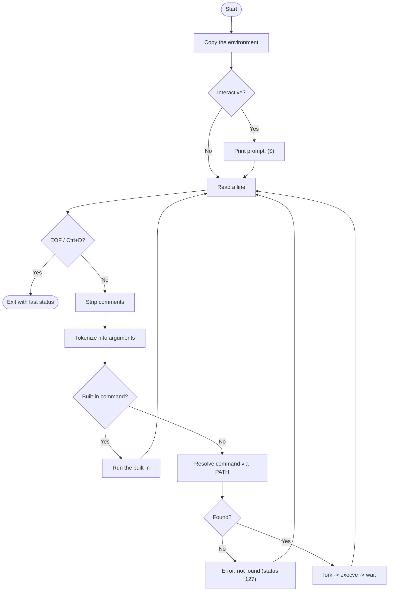

# 🐚 Simple Shell (`hsh`)


A lightweight UNIX command-line interpreter written in C. `hsh` reads commands
from the user (or from a script), resolves them against the `PATH`, and executes
them in a child process — reimplementing the core of a shell such as `/bin/sh`
using only low-level system calls and custom-built string utilities.

---

## 📑 Table of Contents

- [Overview](#-overview)
- [Features](#-features)
- [Requirements](#-requirements)
- [Installation & Compilation](#-installation--compilation)
- [Usage](#-usage)
  - [Interactive mode](#interactive-mode)
  - [Non-interactive mode](#non-interactive-mode)
- [Built-in Commands](#-built-in-commands)
- [How It Works](#-how-it-works)
- [Examples](#-examples)
- [Repository Structure](#-repository-structure)
- [Exit Status Codes](#-exit-status-codes)
- [Authors](#-authors)
- [Acknowledgments](#-acknowledgments)

---

## 📖 Overview

The shell runs in a continuous loop: it displays a prompt (only when connected to
a terminal), reads a full line of input, splits it into a command and its
arguments, and then either runs a **built-in** command directly or launches an
**external program** via `fork` + `execve` + `wait`. The last command's exit
status is preserved and returned when the shell terminates.

All string handling — measuring, copying, comparing, duplicating, tokenizing,
and number conversion — is implemented from scratch rather than relying on the
standard library equivalents.

## ✨ Features

- **Interactive & non-interactive** operation — reads from a terminal or from a
  piped script, showing the `($) ` prompt only when appropriate.
- **Custom line reading** — a buffered `_getline` implementation built on the
  `read` system call.
- **PATH resolution** — searches each directory in the `PATH` variable; commands
  containing a `/` are executed directly.
- **Built-in commands** — `exit`, `env`, `setenv`, `unsetenv`, and `cd`.
- **Comment handling** — anything following a `#` (at the start of the line or
  after whitespace) is ignored.
- **`sh`-style error messages** — diagnostics follow the familiar
  `program: line: command: message` format, printed to `stderr`.
- **Accurate exit statuses** — mirrors the conventions used by standard shells
  (`127`, `126`, `2`, …).
- **Private environment copy** — the shell maintains its own editable copy of the
  environment, kept in sync as variables are added or removed.
- **No memory leaks** — every allocation is tracked and freed on exit.

## 📋 Requirements

| Requirement | Detail |
| :--- | :--- |
| Operating system | Ubuntu 20.04 LTS |
| Compiler | `gcc` |
| Compilation flags | `-Wall -Werror -Wextra -pedantic -std=gnu89` |
| Coding style | Betty (linting) |

## 🔧 Installation & Compilation

Clone the repository and compile all source files into an executable named `hsh`:

```bash
git clone https://github.com/<your-username>/holbertonschool-simple_shell.git
cd holbertonschool-simple_shell
gcc -Wall -Werror -Wextra -pedantic -std=gnu89 *.c -o hsh
```

## 🚀 Usage

### Interactive mode

Launch the shell and type commands at the prompt:

```bash
$ ./hsh
($) ls -l
($) pwd
($) exit
```

### Non-interactive mode

Pipe commands directly into the shell — no prompt is displayed:

```bash
$ echo "ls -l" | ./hsh
$ cat commands.txt | ./hsh
```

## 🧰 Built-in Commands

These commands are handled internally by the shell rather than by an external
program:

| Command | Description |
| :--- | :--- |
| `exit [status]` | Exits the shell. An optional non-negative `status` sets the exit code. |
| `env` | Prints the current environment, one variable per line. |
| `setenv VARIABLE VALUE` | Creates a new environment variable or updates an existing one. |
| `unsetenv VARIABLE` | Removes an environment variable. |
| `cd [DIRECTORY]` | Changes the working directory. Supports `cd`, `cd ~`, `cd -`, and `cd <path>`; updates `PWD` and `OLDPWD`. |

## 🔄 How It Works



## 💡 Examples

**Running external commands with arguments**

```bash
($) /bin/ls -la
($) echo Hello, world
Hello, world
```

**Using the `PATH`**

```bash
($) ls
AUTHORS  README.md  hsh  main.c  shell.h  ...
```

**Ignoring comments**

```bash
($) echo hello   # this part is ignored
hello
```

**Handling an unknown command**

```bash
($) notacommand
./hsh: 1: notacommand: not found
```

**Managing environment variables**

```bash
($) setenv NAME Holberton
($) env | grep NAME
NAME=Holberton
($) unsetenv NAME
```

## 📂 Repository Structure

```
holbertonschool-simple_shell/
├── main.c
├── shell.h
├── getline.c
├── strtok.c
├── exec.c
├── path.c
├── env.c
├── builtins1.c
├── builtins2.c
├── error.c
├── memory.c
├── string_utils1.c
├── string_utils2.c
├── AUTHORS
└── README.md
```

| File | Description |
| :--- | :--- |
| `main.c` | Program entry point and the main read–parse–execute loop. |
| `shell.h` | Header file: macros, the `info_t` data structure, and all prototypes. |
| `getline.c` | `_getline` — buffered line reader built on the `read` system call. |
| `strtok.c` | `_strtok` and `tokenize` — split an input line into an argument array. |
| `exec.c` | `execute` (fork/execve/wait) and `handle_comments`. |
| `path.c` | `find_path` — resolve a command against the `PATH` variable. |
| `env.c` | Environment handling: `init_env`, `_getenv`, `_setenv`, `_unsetenv`, `free_env`. |
| `builtins1.c` | Built-in dispatcher plus `exit`, `env`, `setenv`, and `unsetenv`. |
| `builtins2.c` | The `cd` built-in (`cd`, `cd ~`, `cd -`, `cd <path>`). |
| `error.c` | `print_error` and `print_custom_error` — `sh`-style diagnostics. |
| `memory.c` | `free_array` — free a `NULL`-terminated array of strings. |
| `string_utils1.c` | Custom helpers: `_strlen`, `_strcpy`, `_strcmp`, `_strncmp`, `_strdup`. |
| `string_utils2.c` | Custom helpers: `_strcat`, `_strchr`, `_atoi`, `_itoa`. |
| `AUTHORS` | List of contributors to the repository. |
| `README.md` | This file. |

## 🚦 Exit Status Codes

| Code | Meaning |
| :---: | :--- |
| `0` | Command executed successfully. |
| `2` | Illegal `exit` argument, or a failed `cd`. |
| `126` | The command was found but could not be executed. |
| `127` | The command was not found. |
| *other* | The exit status returned by the last executed command. |

## 👥 Authors

- **Mohammed AbdulAziz AlBadyea**
- **Lujain Abdul Mohsen Alsultan**

## 🙏 Acknowledgments

This project was developed as part of the **Holberton School** low-level
programming curriculum, recreating the fundamentals of a UNIX command
interpreter in C.
